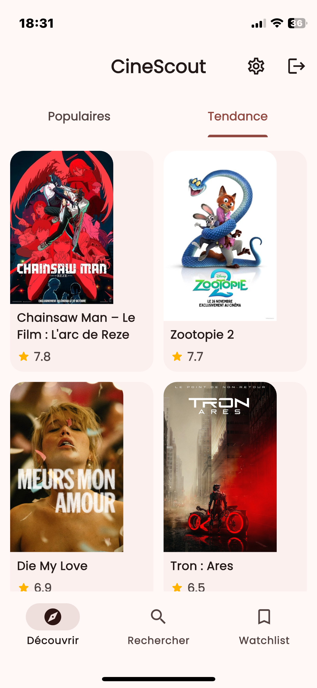
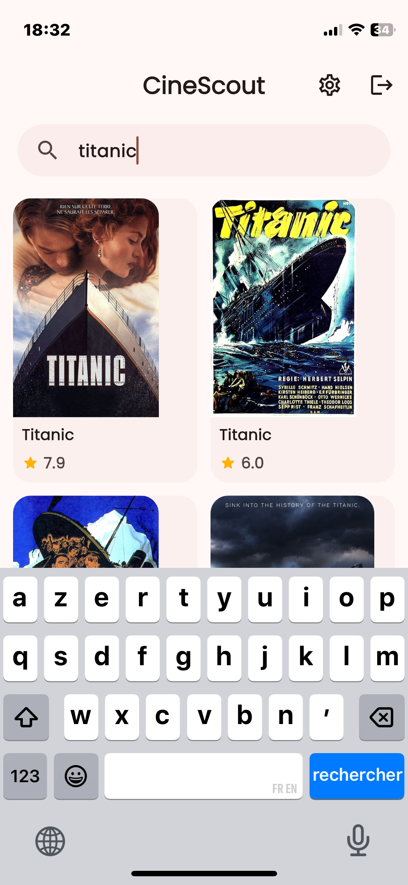

# 📽️ CineScout — Application mobile Flutter pour la découverte de films & la gestion de watchlist


**CineScout** est une application mobile **Flutter** permettant de :

- découvrir les films populaires et en tendance,
- rechercher un film par titre,
- consulter une fiche détaillée (note, synopsis, date, casting),
- gérer une **watchlist** persistante (mode offline),
- personnaliser l’expérience (thème clair/sombre, langue FR/EN).

Les données proviennent de l’API publique **TMDB** (The Movie Database) et sont mises en cache localement avec **sqflite**.

---

## 📌 Sommaire

1. [Fonctionnalités](#-fonctionnalités)
2. [Stack technique](#-stack-technique)
3. [Architecture & organisation du code](#-architecture--organisation-du-code)
4. [Démarrage rapide](#-démarrage-rapide)
   - [Prérequis](#1️⃣-prérequis)
   - [Configuration de lAPI TMDB](#2️⃣-configuration-de-lapi-tmdb)
   - [Lancer lapp-en-local](#3️⃣-lancer-lapp-en-local)
5. [Aperçu (screenshots)](#-aperçu-screenshots)
6. [Roadmap & améliorations possibles](#-roadmap--améliorations-possibles)
7. [Auteurs](#-auteurs)
8. [Licence](#-licence)

---

## ✅ Fonctionnalités

🔐 **Authentification**

- Écran de **connexion** (email / mot de passe)  
- Écran **Créer un compte**  
- Gestion de session et bouton **Déconnexion**

🎬 **Découverte des films**

- Onglet **Découvrir** avec deux sections :
  - **Populaires**
  - **Tendance**
- Grille de cartes responsive (2 à 4 colonnes selon la largeur)
- **Pagination** automatique (chargement page suivante en scrollant)

🔎 **Recherche**

- Barre de recherche avec placeholder  
- Résultats en grille paginée  
- Gestion des états :
  - écran « taper pour rechercher »
  - chargement
  - aucun résultat trouvé
  - message d’erreur en cas de problème réseau

📖 **Détails d’un film**

- Poster HD, note moyenne, date de sortie  
- Synopsis et informations clés  
- casting et lien vers bande-annonce si disponible  
- Bouton **Ajouter à la Watchlist** / **Retirer de la Watchlist**

📚 **Watchlist (mode offline)**

- Onglet dédié **Watchlist**  
- Films enregistrés en base locale **sqflite**  
- Accessible même sans connexion Internet

🧰 **Paramètres & compte**

- **Thème** : clair / sombre  
- **Langue** : Français (FR) / Anglais (EN)  
- Section **Mon compte** :
  - affichage de l’email
  - changement de mot de passe
  - zone de danger : **suppression du compte**

💄 **UI/UX**

- Design minimaliste, inspiré mobile-first  
- Palette douce, boutons arrondis, typographie cohérente  
- Animations discrètes (changements d’onglets, transitions de pages)

---

## 🛠️ Stack technique

| Technologie / Package              | Rôle principal                                               |
|------------------------------------|--------------------------------------------------------------|
| **Flutter 3.x**                    | Framework UI multiplateforme (Android / iOS)                |
| **Dart 3.x**                       | Langage de programmation                                    |
| **flutter_bloc**                    | Gestion d’état réactive (BLoC)                              |
| **go_router**                      | Navigation déclarative & garde d’authentification           |
| **dio**                            | Client HTTP pour l’API TMDB                                 |
| **sqflite**                        | Base de données SQLite locale (watchlist, cache)            |
| **shared_preferences**            | Stockage clé/valeur (thème, langue, préférences)            |
| **cached_network_image**          | Chargement + cache des posters de films                     |
| **flutter_dotenv**                | Gestion des variables d’environnement (.env)                |

---

## 🏗️ Architecture & organisation du code

L’application suit une **Clean Architecture** (séparation data / domain / presentation) afin de faciliter les tests et l’évolutivité.

### Structure simplifiée

```
lib/
├─ core/
│  ├─ errors/
│  ├─ network/
│  └─ language/ (cubit de langue, modèles)
│
├─ features/
│  ├─ auth/
│  │   ├─ data/ (datasources, repositories impl.)
│  │   ├─ domain/ (entities, repositories, usecases)
│  │   └─ presentation/ (bloc, pages Login / Register / Account)
│  │
│  └─ movies/
│      ├─ data/ (TMDb remote DS, local DS, models)
│      ├─ domain/ (Movie, MovieDetails, use cases)
│      └─ presentation/
│          ├─ bloc/ (discover, search, watchlist…)
│          └─ pages/ (DiscoverPage, SearchPage, MovieDetailsPage, WatchlistPage)
│
├─ app/
│  ├─ router/ (go_router configuration)
│  ├─ theme/  (thèmes clair/sombre)
│  └─ app.dart (MaterialApp + injections)
│
└─ main.dart  (point d’entrée)
```

### Principes clés: 

- Presentation : widgets Flutter + BLoC/Cubit
- Domain : entités, contrats de repository, cas d’usage (use cases)
- Data : implémentations concrètes (TMDB, sqflite, shared_preferences)

---

## 🚀 Démarrage rapide

### 1️⃣ Prérequis

✅ Flutter SDK (canal stable) — Installation<br/>
✅ Dart (installé avec Flutter)<br/>
✅ Un IDE compatible (VS Code, Android Studio, IntelliJ…)<br/>
✅ Compte TMDB pour générer une API key (gratuite)<br/>
✅ Pour iOS : Xcode installé + compte Apple (gratuit)<br/>

### 2️⃣ Configuration de l’API TMDB

1. Créer un fichier .env à la racine du projet :

```
TMDB_API_KEY=VOTRE_CLE_API_TMDB_ICI
TMDB_BASE_URL=https://api.themoviedb.org/3
TMDB_IMAGE_BASE_URL=https://image.tmdb.org/t/p
TMDB_LANGUAGE=fr-FR ou TMDB_LANGUAGE=en-US
```

2. Vérifier dans lib/... que les accès à TMDB utilisent bien ces variables via flutter_dotenv.
3. Ne pas versionner la clé dans Git :
- Ajouter .env dans votre .gitignore si ce n’est pas déjà fait.

### 3️⃣ Lancer l’app en local

Installation des dépendances :

```
flutter pub get
```

Lancer sur un émulateur ou un appareil physique :

```
# Liste des devices disponibles
flutter devices

# Lancer sur le device par défaut
flutter run

# OU lancer sur un device spécifique
flutter run -d <id_du_device>
```

Particularités iOS

Pour un test sur iPhone réel :

1. Ouvrir le projet iOS dans Xcode :

```
open ios/Runner.xcworkspace
```

2. Dans Runner > Signing & Capabilities :

- choisir votre Team (Apple ID),
- définir un Bundle Identifier unique (ex. com.example.cinescout),
- lancer sur votre iPhone.

⚠️ La première fois, vous devrez faire confiance au profil développeur sur l’iPhone (Réglages → Général → VPN et gestion de l’appareil).

---

## 🎥 Aperçu (screenshots)

| Splash / Auth        | Découvrir (Populaires / Tendance) | Recherche & résultats |
| -------------------- | --------------------------------- | --------------------- |
|  |             |   |

---

## 🗺️ Roadmap & améliorations possibles

🔁 Ajout de la gestion complète des séries TV <br/>
⭐ Système de recommandations personnalisées (en fonction de la watchlist) <br/>
🧮 Filtres avancés : genre, année, pays, langue originale, note minimale <br/>
🧪 Plus de tests unitaires et widget tests <br/>
📦 Intégration continue (CI/CD) & publication sur Google Play / App Store <br/>

---

## 👥 Auteurs

Anas KRIR — Flutter dev, architecture & intégration TMDB <br/>
Adam EL YOURI — UI/UX, gestion de la watchlist, logique métier <br/>

---

## 📄 Licence

Projet sous licence MIT.<br/>
Vous êtes libre d’utiliser, modifier et distribuer ce code dans vos projets. <br/>

© 2025 — KRIR Anas & EL YOURI Adam <br/>

---

